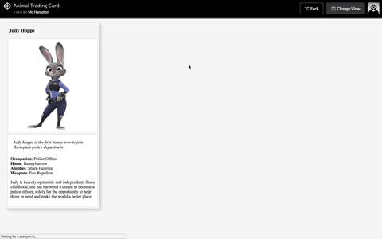
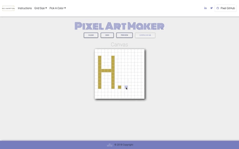

---

# Front-End Developer Projects:

#### Project 1: Mockup to Article
- Employ HTML syntax by converting a mockup of a blog article into a website.

- [Mockup to Article Github](https://mohampton.github.io/MockupToArticle/)
- [Mockup to Article CodePen](https://codepen.io/MoHampton/pen/dJjXzq)
---

#### Project 2: Animal Trading Cards
- Translate a design prototype inspired by trading cards into a functional website.

- [Animal Trading Cards CodePen](https://codepen.io/MoHampton/full/NXOddo/)
---

#### Project 3: Pixel Art Maker
- Build a single-page web app that allows users to draw pixel art on a customizable canvas.

- [Pixel Art Maker Github](https://mohampton.github.io/Pixel-Art-Maker/)
- [Pixel Art Maker CodePen](https://codepen.io/MoHampton/full/wmRNrL/)
---